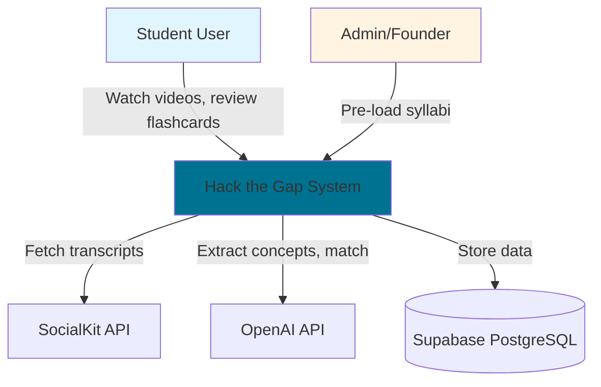
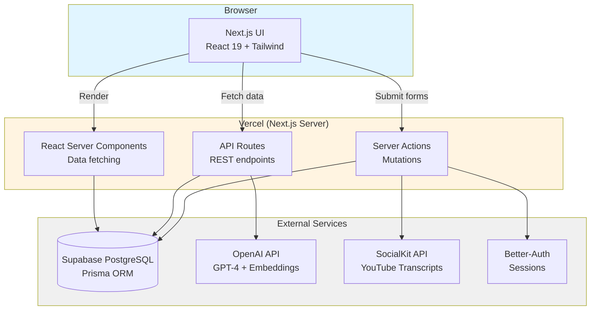
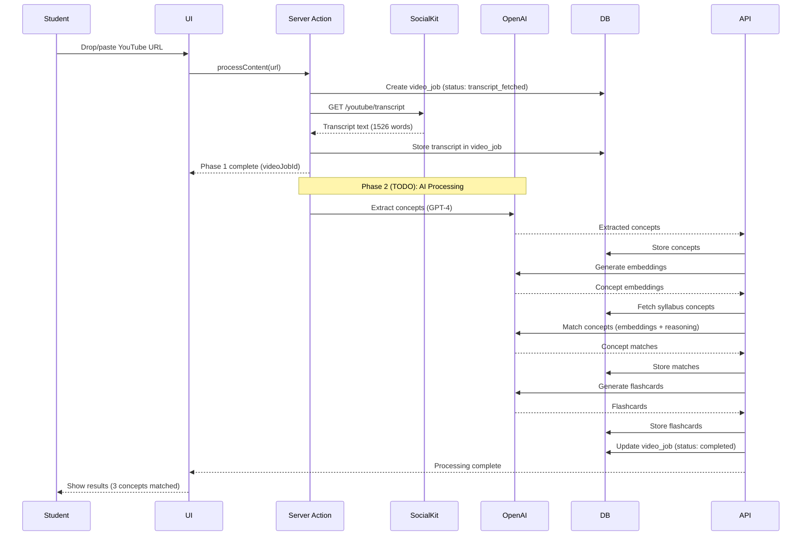

# Architecture Overview

> Living document describing the system architecture for the hackathon MVP.

## System Context

**Primary Users:**

- Students (Motivated Strugglers) - consume content, review flashcards, track progress
- Admin/Founder - pre-load syllabi, monitor system health

**External Systems:**

- SocialKit API - YouTube video transcripts
- OpenAI API - concept extraction, embeddings, matching
- Supabase - PostgreSQL database
- Resend - email notifications (post-MVP)

**System Boundaries:**

- MVP: Single-tenant web app (no multi-org yet)
- Scope: YouTube videos only (no TikTok, PDFs, articles)
- Processing: Synchronous (no background jobs)

## C4 System Context Diagram



## C4 Container Diagram



## Component Architecture

### Frontend (Next.js App Router)

```
app/
├── (auth)/              # Auth pages (signin, signup)
├── (logged-in)/         # Protected routes
│   ├── dashboard/       # Progress dashboard (US-0008)
│   ├── courses/         # Course selection (US-0001)
│   ├── videos/          # Video submission (US-0002)
│   ├── review/          # Flashcard review (US-0006)
│   └── gaps/            # Gap analysis (US-0009)
├── api/                 # API routes
│   ├── videos/          # Video processing
│   ├── concepts/        # Concept extraction
│   ├── flashcards/      # Flashcard generation
│   └── reviews/         # Review sessions
└── _components/         # Shared UI components
```

### Backend Services (Collocated)

```typescript
src/
├── features/
│   ├── videos/
│   │   ├── videoProcessor.ts      # US-0002: Video URL submission
│   │   └── transcriptService.ts   # SocialKit API integration
│   ├── concepts/
│   │   ├── conceptExtractor.ts    # US-0003: AI extraction
│   │   ├── conceptMatcher.ts      # US-0004: Syllabus matching
│   │   └── embeddingService.ts    # OpenAI embeddings
│   ├── flashcards/
│   │   ├── flashcardGenerator.ts  # US-0005: Auto-generation
│   │   └── reviewScheduler.ts     # US-0007: Spaced repetition
│   ├── progress/
│   │   ├── progressService.ts     # US-0008: Dashboard
│   │   └── gapAnalyzer.ts         # US-0009: Gap analysis
│   └── courses/
│       └── courseService.ts       # US-0001: Course selection
└── lib/
    ├── prisma.ts                  # Prisma client
    ├── openai.ts                  # OpenAI client
    └── youtube.ts                 # YouTube client
```

## Tech Stack

See `./tech_stack.md` for detailed stack choices, rationale, and tradeoffs.

**Summary:**

- **Frontend:** Next.js 15.5 (React 19) + Tailwind CSS 4.1 + shadcn/ui
- **Backend:** Next.js API Routes + Server Actions
- **Database:** Supabase (PostgreSQL) + Prisma 6.14
- **Auth:** Better-Auth 1.3
- **AI:** OpenAI (GPT-4 + Embeddings) via Vercel AI SDK
- **Hosting:** Vercel
- **Testing:** Vitest + Playwright

## Key Architectural Decisions

### 1. Monolith Architecture (ADR-0012)

**Decision:** Single Next.js application (frontend + backend)  
**Rationale:** 48-hour MVP timeline requires fastest iteration. No network overhead, simpler deployment.  
**Tradeoffs:** Harder to scale independently, but acceptable for MVP.  
**Post-MVP:** Extract video processing to separate service if needed.

### 2. Synchronous Processing (ADR-0014)

**Decision:** Video processing blocks until complete (60s timeout)  
**Rationale:** Simpler implementation, acceptable for demo.  
**Tradeoffs:** UI blocks during processing, but shows progress.  
**Post-MVP:** Move to async queue (Inngest/BullMQ).

### 3. Server Components First (ADR-TBD)

**Decision:** Use React Server Components by default, client components only when needed  
**Rationale:** Better performance (less JS), simpler data fetching, SEO benefits.  
**Tradeoffs:** Learning curve, debugging complexity.

### 4. Prisma + Raw SQL Hybrid (ADR-TBD)

**Decision:** Prisma for CRUD, raw SQL for complex queries (concept matching)  
**Rationale:** Type safety for 90% of queries, performance for critical paths.  
**Tradeoffs:** Mixed query patterns, but optimizes for both DX and performance.

## Data Flow: Video Processing Pipeline



## Interfaces & Contracts

### Public APIs

**Video Processing:**

- `POST /api/videos/submit` - Submit YouTube URL (US-0002)
- `GET /api/videos/status/:jobId` - Poll processing status
- `POST /api/videos/cancel/:jobId` - Cancel processing

**Flashcard Review:**

- `POST /api/reviews/start` - Start review session (US-0006)
- `POST /api/reviews/:sessionId/rate` - Rate flashcard difficulty
- `POST /api/reviews/:sessionId/complete` - Complete session

**Progress & Analytics:**

- `GET /api/progress/:courseId` - Get progress stats (US-0008)
- `GET /api/gaps/:courseId` - Get gap analysis (US-0009)

**Course Management:**

- `GET /api/courses` - List available courses (US-0001)
- `POST /api/user/select-course` - Select active course

### Data Schema

See `./data/` for complete schema documentation:

- `schema.yml` - JSON Schema definitions
- `data_dictionary.yml` - Field descriptions
- `erd.md` - Entity relationship diagram
- `sample_records.jsonl` - Example data

**Key entities:**

- `users` - Student accounts
- `courses` - Pre-loaded courses (3 for MVP)
- `syllabus_concepts` - Required concepts per course
- `video_jobs` - Processing pipeline tracking
- `concepts` - AI-extracted concepts
- `concept_matches` - Concept-to-syllabus matches
- `flashcards` - Auto-generated review cards
- `review_sessions` - Review tracking

## Operational Concerns

### Deployment

**Environment:** Vercel (production + preview)  
**Process:**

1. Push to GitHub → Vercel auto-deploys
2. Preview deployments for PRs
3. Production deploys on merge to `main`

**Database Migrations:**

```bash
# Development
pnpm prisma migrate dev

# Production (via Vercel build)
pnpm prisma migrate deploy
```

### Observability

**MVP:** Console logs + Vercel logs  
**Post-MVP:** Add Sentry for error tracking

**Key Metrics to Monitor:**

- Video processing success rate
- Average processing time
- Concept extraction accuracy
- API error rates
- Database query performance

### Security

**Authentication:** Better-Auth with session-based auth  
**Authorization:** User can only access their own data  
**API Security:**

- Rate limiting (Vercel built-in)
- Input validation (Zod schemas)
- SQL injection protection (Prisma parameterized queries)

**Secrets Management:**

- Environment variables in Vercel
- Never commit `.env` to git
- Rotate API keys regularly

### Data Retention

**MVP:** Keep all data indefinitely  
**Post-MVP:**

- Archive old video_jobs after 90 days
- Soft delete user accounts (retain for 30 days)
- GDPR compliance: user data export/deletion

### Performance Targets

**MVP Targets:**

- Video processing: <60s (95th percentile)
- Dashboard load: <2s
- Review session: <500ms per card
- API response time: <1s (p95)

**Bottlenecks to Monitor:**

- OpenAI API latency (concept extraction)
- Database query performance (concept matching)
- Embedding generation time

### Scalability Considerations

**Current Limits (MVP):**

- ~100 concurrent users (Vercel free tier)
- ~1000 videos/day (OpenAI rate limits)
- ~10GB database (Supabase free tier)

**Post-MVP Scaling:**

- Move to Vercel Pro ($20/month)
- Implement caching (Redis)
- Extract video processing to separate service
- Add CDN for static assets

## ADRs to Reference

- **ADR-0010**: Database choice (Supabase PostgreSQL)
- **ADR-0011**: Auth provider (Better-Auth)
- **ADR-0012**: Monolith architecture
- **ADR-0013**: AI provider (OpenAI)
- **ADR-0014**: Synchronous processing for MVP

## Related Documentation

- Tech Stack: `./tech_stack.md`
- Data Schema: `./data/`
- User Stories: `./specs/`
- Vision: `./vision.md`
