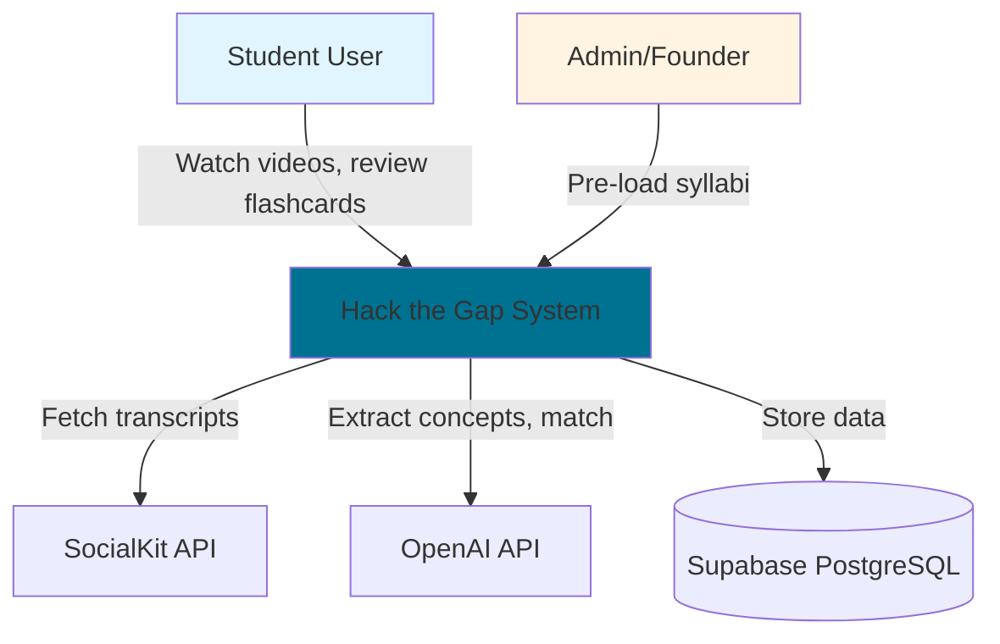
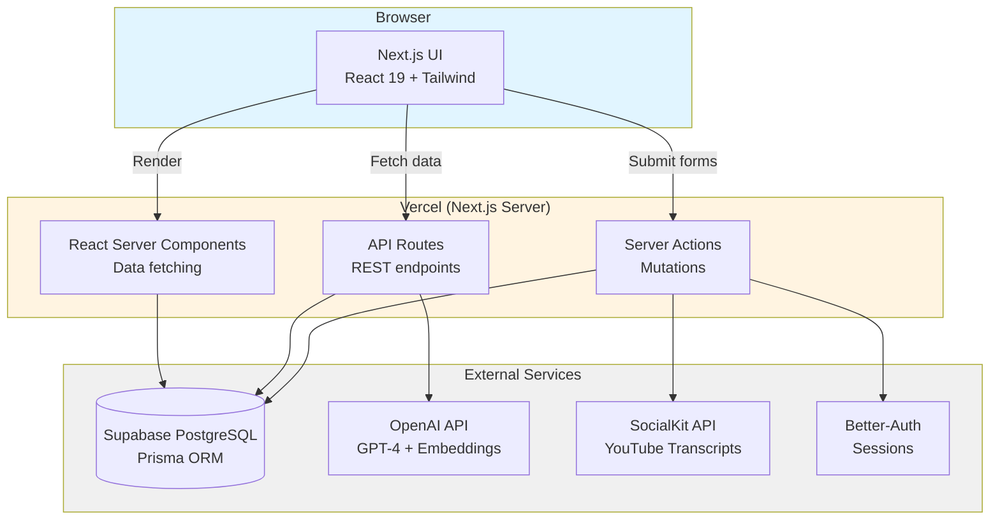
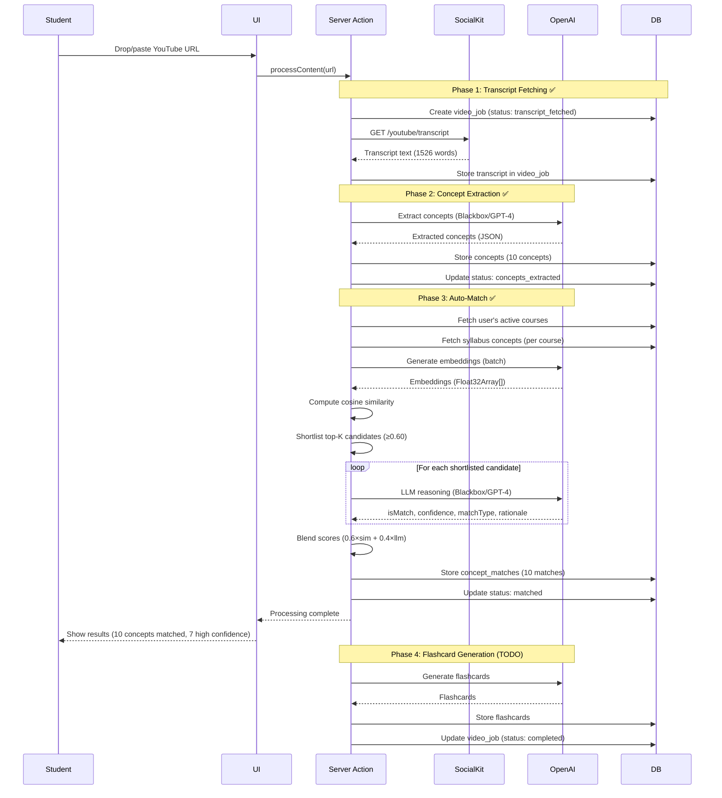

# Architecture Overview

> Living document describing the system architecture for the hackathon MVP.

## System Context

**Primary Users:**

- Students (Motivated Strugglers) - consume content, review flashcards, track progress
- Admin/Founder - pre-load syllabi, monitor system health

**External Systems:**

- SocialKit API - YouTube video transcripts
- OpenAI API - concept extraction, embeddings, matching
- Supabase - PostgreSQL database
- Resend - email notifications (post-MVP)

**System Boundaries:**

- MVP: Single-tenant web app (no multi-org yet)
- Scope: YouTube videos only (no TikTok, PDFs, articles)
- Processing: Synchronous (no background jobs)

## C4 System Context Diagram



## C4 Container Diagram



## Component Architecture

### Frontend (Next.js App Router)

```
app/
├── (auth)/              # Auth pages (signin, signup)
├── (logged-in)/         # Protected routes
│   ├── dashboard/       # Progress dashboard (US-0008)
│   ├── courses/         # Course selection (US-0001) ✅ IMPLEMENTED
│   ├── videos/          # Video submission (US-0002)
│   ├── review/          # Flashcard review (US-0006)
│   └── gaps/            # Gap analysis (US-0009)
├── orgs/[orgSlug]/(navigation)/users/  # ✅ IMPLEMENTED
│   ├── course-selection-card.tsx       # 2x2 grid course interface
│   ├── add-course-dialog.tsx           # Hybrid search dialog
│   └── page.tsx                        # Users page with course selection
    ├── api/                 # API routes
    │   ├── courses/         # ✅ Course management (US-0001) - Updated 2025-11-16
    │   ├── user/courses/    # ✅ User course enrollment - Updated 2025-11-16
    │   ├── subjects/        # ✅ Subject data
    │   ├── videos/          # Video processing
│   ├── concepts/        # Concept extraction
│   ├── flashcards/      # Flashcard generation
│   └── reviews/         # Review sessions
└── _components/         # Shared UI components
```

### Backend Services (Collocated)

```typescript
src/
├── features/
│   ├── matching/                  # ✅ US-0004: IMPLEMENTED
│   │   ├── config.ts              # Thresholds, blend weights, concurrency
│   │   ├── ai-reasoning.ts        # LLM-based concept verification
│   │   ├── concept-matcher.ts     # Hybrid two-stage orchestrator
│   │   ├── write-concept-matches.ts # Idempotent DB writer
│   │   └── README.md              # Technical architecture docs
│   ├── videos/
│   │   ├── videoProcessor.ts      # US-0002: Video URL submission
│   │   └── transcriptService.ts   # SocialKit API integration
│   ├── concepts/
│   │   ├── conceptExtractor.ts    # US-0003: AI extraction
│   │   └── embeddingService.ts    # OpenAI embeddings
│   ├── flashcards/
│   │   ├── flashcardGenerator.ts  # US-0005: Auto-generation
│   │   └── reviewScheduler.ts     # US-0007: Spaced repetition
│   ├── progress/
│   │   ├── progressService.ts     # US-0008: Dashboard
│   │   └── gapAnalyzer.ts         # US-0009: Gap analysis
│   └── courses/
│       └── courseService.ts       # US-0001: Course selection
├── lib/
│   ├── ai/
│   │   └── embeddings.ts          # ✅ OpenAI embeddings service
│   ├── prisma.ts                  # Prisma client
│   ├── ai.ts                      # OpenAI client
│   ├── blackbox.ts                # Blackbox AI client
│   └── youtube.ts                 # YouTube client
└── app/actions/
    ├── process-content.action.ts  # ✅ Video processing + auto-match
    └── match-concepts.action.ts   # ✅ Manual matching trigger
```
=======
### Concept-to-Syllabus Matching Architecture (US-0004)

**Implementation Status:** ✅ Complete (Pending E2E Testing)

**Hybrid Two-Stage Algorithm:**

```
Stage 1: Embedding-Based Shortlisting
├─ Compute cosine similarity (all pairs)
├─ Filter candidates ≥ 0.60 threshold
└─ Select top-K=5 per extracted concept

Stage 2: LLM Reasoning on Shortlist
├─ Call Blackbox/OpenAI for each candidate
├─ Get: isMatch, confidence, matchType, rationale
└─ Concurrency limit: 3 parallel calls

Final Blending:
└─ confidence = 0.6 × similarity + 0.4 × llm_confidence
```

**Components:**

1. **Config** (`src/features/matching/config.ts`)
   - Thresholds: HIGH=0.80, MEDIUM=0.60
   - Blend weights: 0.6 sim + 0.4 LLM
   - Concurrency: 3 parallel LLM calls

2. **Embeddings Service** (`src/lib/ai/embeddings.ts`)
   - OpenAI text-embedding-3-small (1536 dims)
   - Batch processing via Vercel AI SDK
   - Cosine similarity helper

3. **AI Reasoning** (`src/features/matching/ai-reasoning.ts`)
   - LLM verification (Blackbox preferred, OpenAI fallback)
   - Returns: isMatch, confidence, matchType, rationale
   - Low temperature (0.2) for consistency

4. **Concept Matcher** (`src/features/matching/concept-matcher.ts`)
   - Orchestrates two-stage pipeline
   - Handles shortlisting + LLM calls
   - Blends scores and selects best match

5. **DB Writer** (`src/features/matching/write-concept-matches.ts`)
   - Idempotent upserts (one match per concept)
   - Batch operations for performance
   - Cleanup utilities

6. **Server Action** (`app/actions/match-concepts.action.ts`)
   - Authentication & authorization
   - Status tracking (matching → matched/failed)
   - Comprehensive logging

7. **Automatic Triggering** (`app/actions/process-content.action.ts`)
   - Auto-match after concept extraction
   - Smart logic: 0/1/N courses
   - Graceful error handling

**Performance:**
- Target: <20 seconds per video
- Typical: 10-15 seconds (10-50 concepts)
- Cost: ~$0.10 per video (1 course)

**See Also:**
- ADR-0005: Embedding provider selection
- ADR-0006: Hybrid matching algorithm
- ADR-0007: Confidence threshold calibration
- `src/features/matching/README.md`: Technical details

## Tech Stack

See `./tech_stack.md` for detailed stack choices, rationale, and tradeoffs.

**Summary:**

- **Frontend:** Next.js 15.5 (React 19) + Tailwind CSS 4.1 + shadcn/ui
- **Backend:** Next.js API Routes + Server Actions
- **Database:** Supabase (PostgreSQL) + Prisma 6.14
- **Auth:** Better-Auth 1.3
- **AI:** OpenAI (GPT-4 + Embeddings) via Vercel AI SDK
- **Hosting:** Vercel
- **Testing:** Vitest + Playwright

## Key Architectural Decisions

### 1. Monolith Architecture (ADR-0012)

**Decision:** Single Next.js application (frontend + backend)  
**Rationale:** 48-hour MVP timeline requires fastest iteration. No network overhead, simpler deployment.  
**Tradeoffs:** Harder to scale independently, but acceptable for MVP.  
**Post-MVP:** Extract video processing to separate service if needed.

### 2. Synchronous Processing (ADR-0014)

**Decision:** Video processing blocks until complete (60s timeout)  
**Rationale:** Simpler implementation, acceptable for demo.  
**Tradeoffs:** UI blocks during processing, but shows progress.  
**Post-MVP:** Move to async queue (Inngest/BullMQ).

### 3. Server Components First (ADR-TBD)

**Decision:** Use React Server Components by default, client components only when needed  
**Rationale:** Better performance (less JS), simpler data fetching, SEO benefits.  
**Tradeoffs:** Learning curve, debugging complexity.

### 4. Prisma + Raw SQL Hybrid (ADR-TBD)

**Decision:** Prisma for CRUD, raw SQL for complex queries (concept matching)  
**Rationale:** Type safety for 90% of queries, performance for critical paths.  
**Tradeoffs:** Mixed query patterns, but optimizes for both DX and performance.

## Data Flow: Video Processing Pipeline



## Interfaces & Contracts

### Public APIs

**Course Management:** ✅ IMPLEMENTED (US-0001) - Updated 2025-11-16

- `GET /api/courses` - List all available courses with relationships (subject, concept count) - **year/semester removed**
- `GET /api/user/courses` - Get user's active courses with progress - **year/semester removed**
- `POST /api/user/courses` - Add course to user's active courses (body: `{ courseId: string }`)
- `GET /api/subjects` - List all subjects ordered alphabetically
- ~~`GET /api/years`~~ - **REMOVED** (calendar structure deprecated)
- ~~`GET /api/semesters`~~ - **REMOVED** (calendar structure deprecated)

**Knowledge Tree Management:** ⚠️ NOT YET IMPLEMENTED (Future)

- `GET /api/subjects/:subjectId/nodes` - List child nodes (query: `?parentId=uuid|null`)
- `GET /api/subjects/:subjectId/nodes/tree` - Get subtree (query: `?parentId=uuid&depth=int|full`)
- `POST /api/subjects/:subjectId/nodes` - Create node
- `PATCH /api/subjects/:subjectId/nodes/:nodeId` - Update node (rename, reparent, reorder)
- `DELETE /api/subjects/:subjectId/nodes/:nodeId` - Delete empty node
- `POST /api/subjects/:subjectId/nodes/:nodeId/concepts` - Attach syllabus concepts
- `DELETE /api/subjects/:subjectId/nodes/:nodeId/concepts/:syllabusConceptId` - Detach concept

**Video Processing:**

- `POST /api/videos/submit` - Submit YouTube URL (US-0002)
- `GET /api/videos/status/:jobId` - Poll processing status
- `POST /api/videos/cancel/:jobId` - Cancel processing

**Flashcard Review:**

- `POST /api/reviews/start` - Start review session (US-0006)
- `POST /api/reviews/:sessionId/rate` - Rate flashcard difficulty
- `POST /api/reviews/:sessionId/complete` - Complete session

**Progress & Analytics:**

- `GET /api/progress/:courseId` - Get progress stats (US-0008)
- `GET /api/gaps/:courseId` - Get gap analysis (US-0009)

### Data Schema

See `./data/` for complete schema documentation:

- `schema.yml` - JSON Schema definitions
- `data_dictionary.yml` - Field descriptions
- `erd.md` - Entity relationship diagram
- `sample_records.jsonl` - Example data

**Key entities:**

- `users` - Student accounts
- `courses` - Pre-loaded courses (3 for MVP)
- `syllabus_concepts` - Required concepts per course
- `video_jobs` - Processing pipeline tracking
- `concepts` - AI-extracted concepts
- `concept_matches` - Concept-to-syllabus matches
- `flashcards` - Auto-generated review cards
- `review_sessions` - Review tracking

## Operational Concerns

### Deployment

**Environment:** Vercel (production + preview)  
**Process:**

1. Push to GitHub → Vercel auto-deploys
2. Preview deployments for PRs
3. Production deploys on merge to `main`

**Database Migrations:**

```bash
# Development
pnpm prisma migrate dev

# Production (via Vercel build)
pnpm prisma migrate deploy
```

### Observability

**MVP:** Console logs + Vercel logs  
**Post-MVP:** Add Sentry for error tracking

**Key Metrics to Monitor:**

- Video processing success rate
- Average processing time
- Concept extraction accuracy
- API error rates
- Database query performance

### Security

**Authentication:** Better-Auth with session-based auth  
**Authorization:** User can only access their own data  
**API Security:**

- Rate limiting (Vercel built-in)
- Input validation (Zod schemas)
- SQL injection protection (Prisma parameterized queries)

**Secrets Management:**

- Environment variables in Vercel
- Never commit `.env` to git
- Rotate API keys regularly

### Data Retention

**MVP:** Keep all data indefinitely  
**Post-MVP:**

- Archive old video_jobs after 90 days
- Soft delete user accounts (retain for 30 days)
- GDPR compliance: user data export/deletion

### Performance Targets

**MVP Targets:**

- Video processing: <60s (95th percentile)
- Dashboard load: <2s
- Review session: <500ms per card
- API response time: <1s (p95)

**Bottlenecks to Monitor:**

- OpenAI API latency (concept extraction)
- Database query performance (concept matching)
- Embedding generation time

### Scalability Considerations

**Current Limits (MVP):**

- ~100 concurrent users (Vercel free tier)
- ~1000 videos/day (OpenAI rate limits)
- ~10GB database (Supabase free tier)

**Post-MVP Scaling:**

- Move to Vercel Pro ($20/month)
- Implement caching (Redis)
- Extract video processing to separate service
- Add CDN for static assets

## ADRs to Reference

- **ADR-0010**: Database choice (Supabase PostgreSQL)
- **ADR-0011**: Auth provider (Better-Auth)
- **ADR-0012**: Monolith architecture
- **ADR-0013**: AI provider (OpenAI)
- **ADR-0014**: Synchronous processing for MVP

## Related Documentation

- Tech Stack: `./tech_stack.md`
- Data Schema: `./data/`
- User Stories: `./specs/`
- Vision: `./vision.md`
