# Architecture Overview

> Living document describing the system architecture for the hackathon MVP.

## System Context

**Primary Users:**

- Students (Self-Directed Learners) - upload syllabi, consume content, review flashcards, track progress

**External Systems:**

- SocialKit API - YouTube & TikTok video transcripts
- OpenAI API - concept extraction, embeddings, matching
- Supabase - PostgreSQL database
- Resend - email notifications (post-MVP)

**System Boundaries:**

- MVP: Single-tenant web app (no multi-org yet)
- Scope: **YouTube, TikTok, PDFs** (URLs + file upload), articles/podcasts (placeholders)
- Processing: Synchronous (no background jobs)
- Localization: EN/FR bilingual support via next-intl

## C4 System Context Diagram


## C4 Container Diagram


## Component Architecture

### Frontend (Next.js App Router)

```
app/
├── [locale]/            # 🌍 NEW: Locale-based routing (en, fr)
│   ├── layout.tsx       # Locale-specific layout with next-intl provider
│   └── page.tsx         # Localized landing page
├── (auth)/              # Auth pages (signin, signup)
├── (logged-in)/         # Protected routes
│   ├── dashboard/       # Progress dashboard (US-0008) 🚧 TODO
│   │   ├── courses/     # Course management
│   │   │   └── [courseId]/
│   │   │       ├── nodes/[nodeId]/  # 🆕 Node detail pages
│   │   │       ├── review/          # Review sessions
│   │   │       └── page.tsx         # Course overview
│   │   └── users/       # User dashboard with stats
│   ├── syllabus/        # NEW: Syllabus upload (US-0001) 🚧 IN PROGRESS
│   ├── videos/          # Video submission (US-0002) ✅ DONE
│   ├── review/          # Flashcard review (US-0006) ✅ DONE
│   └── gaps/            # Gap analysis (US-0009) 🚧 TODO
├── api/                 # API routes
│   ├── syllabus/        # NEW: Syllabus upload & parsing (US-0001)
│   ├── videos/          # Video processing (US-0002) ✅ DONE
│   ├── flashcards/      # 🆕 Flashcard queries (locked/unlocked filters)
│   ├── user/stats/      # 🆕 User unlock statistics
│   ├── concepts/        # Concept extraction (US-0003) ✅ DONE
│   ├── matches/         # Concept matching (US-0004) ✅ DONE
│   ├── reviews/         # Review sessions (US-0006, US-0007) ✅ DONE
│   └── upload-pdf/      # 🆕 PDF file upload endpoint
└── _components/         # Shared UI components
```

**Deprecated (2025-11-17):**
- ~~`courses/`~~ - Course selection no longer needed
- ~~`orgs/[orgSlug]/(navigation)/users/`~~ - Course selection UI removed

### Backend Services (Collocated)

```typescript
src/
├── features/
│   ├── content-extraction/        # 🆕 Unified content processor
│   │   ├── index.ts               # Auto-detection + unified interface
│   │   ├── types.ts               # ExtractionResult types
│   │   ├── video-extractor.ts     # YouTube/TikTok via SocialKit
│   │   ├── pdf-extractor.ts       # PDF text via pdf-parse
│   │   ├── url-extractor.ts       # Article extraction (placeholder)
│   │   └── podcast-extractor.ts   # Podcast transcription (placeholder)
│   ├── matching/                  # ✅ US-0004: IMPLEMENTED
│   │   ├── config.ts              # Thresholds, blend weights, concurrency
│   │   ├── ai-reasoning.ts        # LLM-based concept verification
│   │   ├── concept-matcher.ts     # Hybrid two-stage orchestrator
│   │   ├── write-concept-matches.ts # Idempotent DB writer
│   │   └── README.md              # Technical architecture docs
│   ├── i18n/                      # 🌍 Internationalization
│   │   └── language-switcher.tsx  # Locale switcher component
│   ├── videos/
│   │   ├── videoProcessor.ts      # US-0002: Video URL submission
│   │   └── transcriptService.ts   # SocialKit API integration
│   ├── concepts/
│   │   ├── conceptExtractor.ts    # US-0003: AI extraction
│   │   └── embeddingService.ts    # OpenAI embeddings
│   ├── flashcards/
│   │   ├── flashcardGenerator.ts  # US-0005: Auto-generation
│   │   ├── reviewScheduler.ts     # US-0007: Spaced repetition
│   │   └── unlock-service.ts      # 🆕 Answer unlock system (357 lines)
│   ├── notifications/
│   │   └── unlock-notifications.ts # 🆕 Unlock toast notifications (143 lines)
│   ├── progress/
│   │   ├── progressService.ts     # US-0008: Dashboard
│   │   └── gapAnalyzer.ts         # US-0009: Gap analysis
│   └── courses/
│       └── courseService.ts       # US-0001: Course selection
├── i18n/                          # 🌍 i18n configuration
│   └── request.ts                 # Server-side locale resolution
├── lib/
│   ├── ai/
│   │   └── embeddings.ts          # ✅ OpenAI embeddings service
│   ├── prisma.ts                  # Prisma client
│   ├── ai.ts                      # OpenAI client
│   ├── blackbox.ts                # Blackbox AI client
│   └── youtube.ts                 # YouTube client
├── components/
│   ├── dashboard/
│   │   ├── unlock-progress.tsx    # 🆕 Unlock progress visualization
│   │   └── content-recommendations.tsx # 🆕 Smart content suggestions
└── app/actions/
    ├── process-content.action.ts  # ✅ Content processing + auto-match (all types)
    └── match-concepts.action.ts   # ✅ Manual matching trigger
```
=======
### Concept-to-Syllabus Matching Architecture (US-0004)

**Implementation Status:** ✅ Complete (Pending E2E Testing)

**Hybrid Two-Stage Algorithm:**

```
Stage 1: Embedding-Based Shortlisting
├─ Compute cosine similarity (all pairs)
├─ Filter candidates ≥ 0.60 threshold
└─ Select top-K=5 per extracted concept

Stage 2: LLM Reasoning on Shortlist
├─ Call Blackbox/OpenAI for each candidate
├─ Get: isMatch, confidence, matchType, rationale
└─ Concurrency limit: 3 parallel calls

Final Blending:
└─ confidence = 0.6 × similarity + 0.4 × llm_confidence
```

**Components:**

1. **Config** (`src/features/matching/config.ts`)
   - Thresholds: HIGH=0.80, MEDIUM=0.60
   - Blend weights: 0.6 sim + 0.4 LLM
   - Concurrency: 3 parallel LLM calls

2. **Embeddings Service** (`src/lib/ai/embeddings.ts`)
   - OpenAI text-embedding-3-large (3072 dims) - **UPGRADED 2025-11-18**
   - Multilingual support: 100+ languages with cross-lingual semantic matching
   - ~95% cosine similarity for equivalent concepts across languages
   - Example: "Photosynthèse" (FR) ↔ "Photosynthesis" (EN) = 0.96 similarity
   - Batch processing via Vercel AI SDK
   - Cosine similarity helper

3. **AI Reasoning** (`src/features/matching/ai-reasoning.ts`)
   - LLM verification (Blackbox preferred, OpenAI fallback)
   - Returns: isMatch, confidence, matchType, rationale
   - Low temperature (0.2) for consistency

4. **Concept Matcher** (`src/features/matching/concept-matcher.ts`)
   - Orchestrates two-stage pipeline
   - Handles shortlisting + LLM calls
   - Blends scores and selects best match

5. **DB Writer** (`src/features/matching/write-concept-matches.ts`)
   - Idempotent upserts (one match per concept)
   - Batch operations for performance
   - Cleanup utilities

6. **Server Action** (`app/actions/match-concepts.action.ts`)
   - Authentication & authorization
   - Status tracking (matching → matched/failed)
   - Comprehensive logging

7. **Automatic Triggering** (`app/actions/process-content.action.ts`)
   - Auto-match after concept extraction
   - Smart logic: 0/1/N courses
   - Graceful error handling

**Performance:**
- Target: <20 seconds per video
- Typical: 10-15 seconds (10-50 concepts)
- Cost: ~$0.10 per video (1 course)

**See Also:**
- ADR-0005: Embedding provider selection (text-embedding-3-small, superseded by ADR-0017)
- ADR-0006: Hybrid matching algorithm
- ADR-0007: Confidence threshold calibration
- ADR-0017: Multilingual embeddings strategy (text-embedding-3-large upgrade)
- `src/features/matching/README.md`: Technical details

## Flashcard Answer Unlock System (2025-11-18)

**Implementation Status:** ✅ Complete

**Concept:** Gamified learning where flashcards start locked (question-only) and unlock when high-confidence concept matches are found.

**Unlock Flow:**

```
Content Processing → Concept Matching (≥70% confidence) → Unlock Service → Answer Generation → Notification
```

**Components:**

1. **Database Schema** (Migration: `20251118075121_add_flashcard_unlock_system`)
   - `unlock_events` table: Tracks unlock history
   - `user_stats` table: Aggregate metrics (totalUnlocks, totalLocked, unlockRate)
   - `flashcards` table updates:
     - `state`: locked | unlocked | mastered
     - `unlockedAt`: Timestamp
     - `unlockedBy`: contentJobId
     - `unlockProgress`: 0.0-1.0 (Phase 2)
     - `relatedContentIds`: JSON array (Phase 2)
     - `hints`: JSON array (available when locked)
     - Composite index: (userId, nextReviewAt)

2. **Unlock Service** (`src/features/flashcards/unlock-service.ts`)
   - Processes concept matches ≥70% confidence
   - Generates answers from matched content using AI
   - Updates flashcard state: locked → unlocked
   - Creates unlock events for analytics
   - Updates user stats
   - Returns unlock results for notifications

3. **Notification System** (`src/lib/notifications/unlock-notifications.ts`)
   - Toast notifications for unlocked flashcards
   - Displays: question, concept, source, confidence
   - Grouped notifications for multiple unlocks
   - "View unlocked cards" CTA

4. **API Routes**
   - `GET /api/flashcards`: Fetch user flashcards with filters (locked/unlocked/all)
   - `GET /api/user/stats`: Fetch user unlock statistics

5. **Dashboard Components**
   - `unlock-progress.tsx`: Visual progress bar, unlock rate, locked/unlocked counts
   - `content-recommendations.tsx`: Suggests content to unlock remaining flashcards
   - Updated user dashboard: Shows unlock stats and progress

6. **UI Components**
   - `flashcard-card.tsx`: Locked/unlocked states with visual indicators (🔒/🔓)
   - `flashcard-list.tsx`: Filter by state, sort by unlock status

7. **Integration**
   - Wired into concept matching pipeline (`app/actions/match-concepts.action.ts`)
   - Auto-triggers after high-confidence matches found

**Unlock Threshold:** 70% confidence (lowered from 80%)
- Rationale: Balance between accuracy and unlock frequency
- See ADR-0018 for decision details

**Performance:**
- Answer generation: ~2-3 seconds per flashcard
- Batch processing: Parallel unlock for multiple matches
- Database: Optimized composite index for queries

**See Also:**
- ADR-0018: Unlock threshold decision (70% confidence)
- `FLASHCARD_UNLOCK_TESTING_GUIDE.md`: Comprehensive testing guide
- `UX_REFACTOR_PLAN.md`: UX planning document

## Tech Stack

See `./tech_stack.md` for detailed stack choices, rationale, and tradeoffs.

**Summary:**

- **Frontend:** Next.js 15.5 (React 19) + Tailwind CSS 4.1 + shadcn/ui
- **Backend:** Next.js API Routes + Server Actions
- **Database:** Supabase (PostgreSQL) + Prisma 6.14
- **Auth:** Better-Auth 1.3
- **AI:** OpenAI (GPT-4 + Embeddings) via Vercel AI SDK
- **Hosting:** Vercel
- **Testing:** Vitest + Playwright

## Key Architectural Decisions

### 1. Monolith Architecture (ADR-0012)

**Decision:** Single Next.js application (frontend + backend)  
**Rationale:** 48-hour MVP timeline requires fastest iteration. No network overhead, simpler deployment.  
**Tradeoffs:** Harder to scale independently, but acceptable for MVP.  
**Post-MVP:** Extract video processing to separate service if needed.

### 2. Synchronous Processing (ADR-0014)

**Decision:** Video processing blocks until complete (60s timeout)  
**Rationale:** Simpler implementation, acceptable for demo.  
**Tradeoffs:** UI blocks during processing, but shows progress.  
**Post-MVP:** Move to async queue (Inngest/BullMQ).

### 3. Server Components First (ADR-TBD)

**Decision:** Use React Server Components by default, client components only when needed  
**Rationale:** Better performance (less JS), simpler data fetching, SEO benefits.  
**Tradeoffs:** Learning curve, debugging complexity.

### 4. Prisma + Raw SQL Hybrid (ADR-TBD)

**Decision:** Prisma for CRUD, raw SQL for complex queries (concept matching)  
**Rationale:** Type safety for 90% of queries, performance for critical paths.  
**Tradeoffs:** Mixed query patterns, but optimizes for both DX and performance.

### 5. Inline Flashcards + Bilingual Content (ADR-0010)

**Decision:** Generate flashcards inline during extraction and persist bilingual content (EN/FR) for concepts and flashcards.  
**Rationale:** Immediate study readiness and accessibility; eliminates separate generation step and reduces friction.  
**Tradeoffs:** Larger AI payloads and more complex transactions/migrations; parser robustness requirements increase.  
**References:** ADR-0010 and docs/data/schema.yml additions (concept_localizations, flashcard_localizations).

## Data Flow: Complete Pipeline (Updated 2025-11-17)

### Phase 0: Syllabus Upload (NEW - US-0001) 🚧 IN PROGRESS


### Phase 1-4: Content Processing (COMPLETE - US-0002 through US-0007) ✅

```mermaid
sequenceDiagram
    participant Student
    participant UI
    participant SA as Server Action
    participant SocialKit
    participant OpenAI
    participant DB
    
    Student->>UI: Drop/paste YouTube URL
    UI->>SA: processContent(url)
    
    Note over SA,DB: Phase 1: Transcript Fetching ✅
    SA->>DB: Create video_job
    SA->>SocialKit: GET /youtube/transcript
    SocialKit-->>SA: Transcript text
    SA->>DB: Store transcript
    
    Note over SA,OpenAI: Phase 2: Concept Extraction ✅
    SA->>OpenAI: Extract concepts (Blackbox/GPT-4)
    OpenAI-->>SA: Extracted concepts (JSON)
    SA->>DB: Store concepts
    
    Note over SA,OpenAI: Phase 3: Auto-Match ✅
    SA->>DB: Fetch user's learning goals (syllabus_concepts)
    SA->>OpenAI: Generate embeddings (batch)
    OpenAI-->>SA: Embeddings
    SA->>SA: Compute cosine similarity
    SA->>SA: Shortlist top-K candidates
    
    loop For each candidate
        SA->>OpenAI: LLM reasoning
        OpenAI-->>SA: isMatch, confidence, rationale
    end
    
    SA->>SA: Blend scores (0.6×sim + 0.4×llm)
    SA->>DB: Store concept_matches
    
    Note over SA,OpenAI: Phase 4: Flashcard Generation ✅
    SA->>OpenAI: Generate flashcards
    OpenAI-->>SA: Flashcards
    SA->>DB: Store flashcards
    SA->>DB: Update video_job (status: completed)
    SA-->>UI: Processing complete
    UI-->>Student: Show matched concepts + flashcards
```



## Interfaces & Contracts

### Public APIs

**Syllabus Management:** 🚧 IN PROGRESS (NEW US-0001)

- `POST /api/syllabus/upload` - Upload syllabus file (PDF, Word, text, image)
- `POST /api/syllabus/extract` - Extract concepts from uploaded syllabus using AI
- `POST /api/syllabus/conversation` - AI conversation to define learning goals (alternative to upload)
- `GET /api/syllabus/:userId` - Get user's uploaded syllabi and extracted concepts
- `DELETE /api/syllabus/:syllabusId` - Delete syllabus and associated concepts

**Flashcard Queries:** ✅ IMPLEMENTED (2025-11-18)

- `GET /api/flashcards` - Fetch user flashcards with filters (locked/unlocked/all)

**User Statistics:** ✅ IMPLEMENTED (2025-11-18)

- `GET /api/user/stats` - Fetch user unlock statistics (totalUnlocks, totalLocked, unlockRate)

**Deprecated (2025-11-17):**
- ~~`GET /api/courses`~~ - No longer needed (students upload their own)
- ~~`GET /api/user/courses`~~ - No longer needed
- ~~`POST /api/user/courses`~~ - No longer needed
- ~~`GET /api/subjects`~~ - May be repurposed for categorization
- ~~`GET /api/years`~~ - Removed
- ~~`GET /api/semesters`~~ - Removed

**Video Processing:**

- `POST /api/videos/submit` - Submit YouTube URL (US-0002)
- `GET /api/videos/status/:jobId` - Poll processing status
- `POST /api/videos/cancel/:jobId` - Cancel processing

**Flashcard Review:**

- `POST /api/reviews/start` - Start review session (US-0006)
- `POST /api/reviews/:sessionId/rate` - Rate flashcard difficulty
- `POST /api/reviews/:sessionId/complete` - Complete session

**Progress & Analytics:**

- `GET /api/progress/:courseId` - Get progress stats (US-0008)
- `GET /api/gaps/:courseId` - Get gap analysis (US-0009)

### Data Schema

See `./data/` for complete schema documentation:

- `schema.yml` - JSON Schema definitions
- `data_dictionary.yml` - Field descriptions
- `erd.md` - Entity relationship diagram
- `sample_records.jsonl` - Example data

**Key entities:**

- `users` - Student accounts
- `user_syllabi` - NEW: User-uploaded syllabi
- `syllabus_concepts` - Learning goal concepts (extracted from user syllabi)
- `video_jobs` - Processing pipeline tracking
- `concepts` - AI-extracted concepts from content
- `concept_matches` - Concept-to-goal matches
- `flashcards` - Auto-generated review cards
- `review_sessions` - Review tracking
- `review_events` - Individual review attempts
- `unlock_events` - Flashcard unlock history
- `user_stats` - Aggregate user statistics

**Deprecated (2025-11-17):**
- ~~`courses`~~ - No longer needed (students upload their own)
- ~~`user_courses`~~ - No longer needed
- ~~`academic_years`~~ - Removed for global flexibility
- ~~`semesters`~~ - Removed for global flexibility

## Operational Concerns

### Deployment

**Environment:** Vercel (production + preview)  
**Process:**

1. Push to GitHub → Vercel auto-deploys
2. Preview deployments for PRs
3. Production deploys on merge to `main`

**Database Migrations:**

```bash
# Development
pnpm prisma migrate dev

# Production (via Vercel build)
pnpm prisma migrate deploy
```

### Observability

**MVP:** Console logs + Vercel logs  
**Post-MVP:** Add Sentry for error tracking

**Key Metrics to Monitor:**

- Video processing success rate
- Average processing time
- Concept extraction accuracy
- API error rates
- Database query performance

### Security

**Authentication:** Better-Auth with session-based auth  
**Authorization:** User can only access their own data  
**API Security:**

- Rate limiting (Vercel built-in)
- Input validation (Zod schemas)
- SQL injection protection (Prisma parameterized queries)

**Secrets Management:**

- Environment variables in Vercel
- Never commit `.env` to git
- Rotate API keys regularly

### Data Retention

**MVP:** Keep all data indefinitely  
**Post-MVP:**

- Archive old video_jobs after 90 days
- Soft delete user accounts (retain for 30 days)
- GDPR compliance: user data export/deletion

### Performance Targets

**MVP Targets:**

- Video processing: <60s (95th percentile)
- Dashboard load: <2s
- Review session: <500ms per card
- API response time: <1s (p95)

**Bottlenecks to Monitor:**

- OpenAI API latency (concept extraction)
- Database query performance (concept matching)
- Embedding generation time

### Scalability Considerations

**Current Limits (MVP):**

- ~100 concurrent users (Vercel free tier)
- ~1000 videos/day (OpenAI rate limits)
- ~10GB database (Supabase free tier)

**Post-MVP Scaling:**

- Move to Vercel Pro ($20/month)
- Implement caching (Redis)
- Extract video processing to separate service
- Add CDN for static assets

## ADRs to Reference

- **ADR-0010**: Database choice (Supabase PostgreSQL)
- **ADR-0011**: Auth provider (Better-Auth)
- **ADR-0012**: Monolith architecture
- **ADR-0013**: AI provider (OpenAI)
- **ADR-0014**: Synchronous processing for MVP
- **ADR-0015**: TODO: Internationalization strategy (next-intl, locale routing)
- **ADR-0016**: TODO: Content type architecture (unified processor, polymorphic schema)

## Related Documentation

- Tech Stack: `./tech_stack.md`
- Data Schema: `./data/`
- User Stories: `./specs/`
- Vision: `./vision.md`

## Content Extraction Architecture (2025-11-18)

### Unified Content Processor

All content types flow through a unified pipeline:

```
Content Input → Type Detection → Extraction → ContentJob → AI Processing → Flashcards
```

**Module:** `/src/features/content-extraction/`

**Supported Types:**
- `youtube`: SocialKit API transcript extraction
- `tiktok`: SocialKit API transcript extraction  
- `pdf`: pdf-parse text extraction (URL + file upload)
- `url`: Article text extraction (placeholder)
- `podcast`: Audio transcription (placeholder)

**Key Components:**
- `index.ts`: Auto-detection + unified interface (`extractContent()`)
- `video-extractor.ts`: YouTube/TikTok via SocialKit
- `pdf-extractor.ts`: PDF text via pdf-parse (supports Buffer + URL)
- `url-extractor.ts`: Article extraction (TODO: Jina AI Reader)
- `podcast-extractor.ts`: Podcast transcription (TODO: Whisper)

**Database:** `ContentJob` model (replaces `VideoJob`)
- Polymorphic: content-type specific fields (youtubeVideoId, fileName, pageCount, etc.)
- Common fields: extractedText, status, processedConceptsCount
- Backward compatible: table name `video_jobs`, column mappings

**Processing Flow:**
1. URL/File → Type detection
2. Extract text (video transcript, PDF text, etc.)
3. Store in ContentJob
4. AI concept extraction (same prompt for all types)
5. Match to course syllabus
6. Generate flashcards

**Upload Endpoint:** `/api/upload-pdf`
- Max 10MB
- PDF validation
- Returns extracted text + metadata
- Client calls `processUploadedPDF()` action

## Multilingual Semantic Matching (2025-11-18)

### Cross-Lingual Concept Matching

**Problem:** Students consume content in one language (e.g., English videos) but have syllabi in another (e.g., French courses).

**Solution:** Multilingual embeddings enable cross-lingual semantic matching without translation.

**How It Works:**
1. **Multilingual Embeddings**: text-embedding-3-large maps semantically equivalent concepts to nearby points in vector space regardless of language
2. **Language Preservation**: Concepts extracted in original language (no translation during extraction)
3. **Cross-Lingual Matching**: French syllabus concept "Photosynthèse" matches English video concept "Photosynthesis" with 0.96 cosine similarity
4. **Bilingual Flashcards**: When language mismatch detected, generate flashcards with both languages

**Database Schema:**
- `concepts.language`: Detected language of extracted concept (default: 'en')
- `syllabus_concepts.language`: Language of syllabus concept (default: 'en')
- `flashcards.language`: Primary language of flashcard (default: 'en')
- `flashcards.questionTranslation`: Translation of question (nullable)
- `flashcards.answerTranslation`: Translation of answer (nullable)

**Example Flow:**
```
French Student with French Syllabus:
1. Syllabus concept: "Photosynthèse" (FR) → embedding vector A
2. Watches English video: "Photosynthesis" (EN) → embedding vector B
3. Cosine similarity(A, B) = 0.96 (HIGH match)
4. Generate bilingual flashcard:
   - Question (FR): "Qu'est-ce que la photosynthèse?"
   - Question Translation (EN): "What is photosynthesis?"
   - Answer (FR): "Processus par lequel..."
   - Answer Translation (EN): "Process by which..."
```

**Supported Languages:** EN, FR, ES, DE, IT, PT, NL, PL, RU, JA, ZH, KO, AR, and 100+ others

**Performance:**
- Accuracy: ~95% similarity for equivalent concepts across languages
- Cost: +10% per video (~$0.11 vs $0.10 with text-embedding-3-small)
- Latency: Same as monolingual (no translation step)

**See Also:**
- ADR-0017: Multilingual embeddings strategy
- Migration: `20251118050709_add_language_support`

## Internationalization Architecture (2025-11-18)

### Locale Routing Strategy

**Framework:** next-intl 4.5.3

**Routing Pattern:**
```
/{locale}/...           # All routes prefixed with locale
/en/dashboard           # English dashboard
/fr/dashboard           # French dashboard
/en/courses/{id}        # English course detail
/fr/courses/{id}        # French course detail
```

**Locale Detection:**
1. URL path segment (highest priority)
2. Cookie (`NEXT_LOCALE`)
3. Accept-Language header
4. Default: `en`

**Middleware:** `middleware.ts`
- Intercepts all requests
- Detects locale from URL/cookie/header
- Redirects to localized route if needed
- Sets `NEXT_LOCALE` cookie

**Configuration:**
- `src/i18n.ts`: Locale definitions (`en`, `fr`), type guards
- `src/i18n/request.ts`: Server-side locale resolution
- `next.config.ts`: next-intl plugin integration

### Message Catalogs

**Location:** `messages/{locale}.json`

**Structure:**
```json
{
  "dashboard": {
    "title": "Dashboard",
    "courses": {
      "empty": "No courses yet",
      "add": "Add course"
    }
  },
  "auth": {
    "signin": { ... },
    "signup": { ... }
  },
  "navigation": { ... },
  "footer": { ... }
}
```

**Coverage:** 300+ translation keys across:
- Dashboard (courses, users, stats, charts)
- Auth (sign-in, sign-up, forms)
- Navigation (sidebar, breadcrumbs)
- Charts (labels, tooltips)
- Footer (links, copyright)

### Component Localization

**Server Components:**
```typescript
import { getTranslations } from 'next-intl/server';

const t = await getTranslations('dashboard');
return <h1>{t('title')}</h1>;
```

**Client Components:**
```typescript
import { useTranslations } from 'next-intl';

const t = useTranslations('dashboard');
return <h1>{t('title')}</h1>;
```

**Locale-Aware Links:**
```typescript
import { Link } from '@/i18n/routing';

<Link href="/dashboard">Dashboard</Link>
// Automatically prefixes with current locale
```

### Language Switcher

**Primary Component:** User Settings Dropdown (`src/features/auth/user-dropdown.tsx`)
- Integrated in user dropdown menu (below theme selector)
- Flag emojis for visual identification: 🇬🇧 English, 🇫🇷 Français
- Switches between EN/FR with `changeLanguage()` function
- Preserves current page path (removes old locale, adds new locale)
- Uses next-intl's locale switching mechanism
- Updates URL immediately: `/en/dashboard` ↔ `/fr/dashboard`

**Alternative Component:** `src/features/i18n/language-switcher.tsx`
- Standalone language switcher component (if needed in other locations)
- Can be placed in navigation, footer, or other UI areas

---

## Related Documents

### Vision & Planning

- **[Product Vision](./vision.md)** - Problem, solution, target users, value proposition
- **[Roadmap](./roadmap.md)** - Timeline, milestones, and strategic bets
- **[Tasks](./tasks.md)** - Current work, backlog, and sprint notes

### Technical Details

- **[Tech Stack](./tech_stack.md)** - Technology choices and rationale
- **[Data Schema](./data/)** - Database structure and relationships
  - [ERD](./data/erd.md) - Entity relationship diagram
  - [Data Dictionary](./data/data_dictionary.yml) - Field definitions
  - [Migration History](./data/MIGRATION_HISTORY.md) - Schema changes over time

### Key Architectural Decisions

- **[ADR-0011: Auth Provider](./decisions/ADR-0011-auth-provider-selection.md)** - Better-Auth selection
- **[ADR-0012: Monolith Architecture](./decisions/ADR-0012-monolith-architecture.md)** - Single Next.js app
- **[ADR-0013: AI Provider](./decisions/ADR-0013-ai-provider-selection.md)** - Claude + OpenAI hybrid
- **[ADR-0014: Synchronous Processing](./decisions/ADR-0014-synchronous-processing-for-mvp.md)** - No async queue for MVP
- **[ADR-0015: Internationalization](./decisions/ADR-0015-internationalization-strategy.md)** - next-intl implementation
- **[ADR-0016: Content Type Architecture](./decisions/ADR-0016-content-type-architecture.md)** - Unified processor
- **[ADR-0017: Multilingual Embeddings](./decisions/ADR-0017-multilingual-embeddings-strategy.md)** - Cross-lingual matching
- **[ADR-0019: Build Error Suppression](./decisions/ADR-0019-build-error-suppression-for-cicd.md)** - CI/CD optimization

### Implementation Guides

- **[Testing Strategy](./guides/TESTING_STRATEGY.md)** - Test coverage, E2E scenarios, performance benchmarks
- **[User Stories](./specs/)** - Feature specifications
  - [US-0002: Video URL Submission](./specs/us-0002-video-url-submission.md)
  - [US-0003: Concept Extraction](./specs/us-0003-concept-extraction.md)
  - [US-0004: Concept Matching](./specs/us-0004-concept-to-syllabus-matching.md)
  - [US-0005: Flashcard Generation](./specs/us-0005-flashcard-generation.md)
  - [US-0006: First Review Session](./specs/us-0006-first-review-session.md)
  - [US-0007: Review Scheduling](./specs/us-0007-review-scheduling.md)

### Reference

- **[Glossary](./GLOSSARY.md)** - Canonical terminology
- **[Context Bundle](./context.md)** - Quick start for AI/humans
