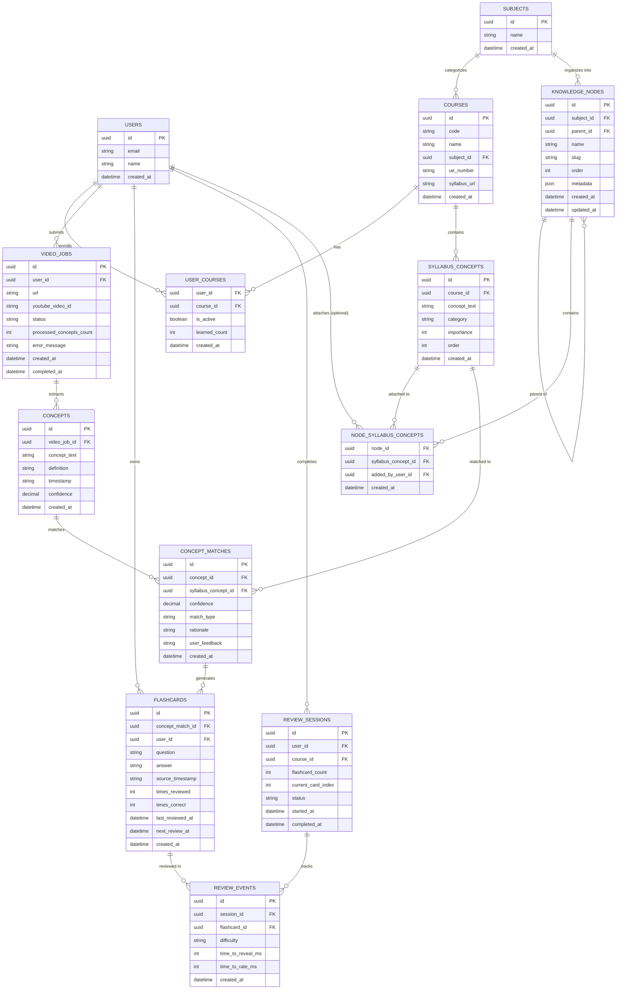

# Entity Relationship Diagram

> Updated: 2025-11-16 - Knowledge Tree Migration

## Notes

- **Normalized schema**: 12 tables (removed academic_years and semesters, added knowledge_nodes and node_syllabus_concepts)
- **Simplified hierarchy**: Courses now only reference subject (no year/semester)
- **Flexible knowledge tree**: `knowledge_nodes` provides arbitrary-depth organization within subjects
- **Tree structure**: Self-referential `parent_id` in `knowledge_nodes` enables hierarchical organization
- **Optional concept organization**: `node_syllabus_concepts` junction allows attaching concepts to tree nodes
- **Dynamic concept counts**: Total concepts per course computed from `COUNT(syllabus_concepts)`, not hardcoded
- **Syllabus-driven**: Concept counts emerge from AI processing of actual syllabus PDFs
- **Hard deletes**: No soft delete columns (`deleted_at`)
- **No retention policies**: Keep all data for demo
- **Single active course**: `user_courses.is_active` flag
- **Pre-computed learned_count**: `user_courses.learned_count` for dashboard performance ("12 learned")

## Migration Notes (2025-11-16)

**Removed:**
- `academic_years` table (rigid calendar structure)
- `semesters` table (rigid calendar structure)
- `courses.year_id` field
- `courses.semester_id` field

**Added:**
- `knowledge_nodes` table (flexible tree hierarchy)
- `node_syllabus_concepts` junction table (organize concepts into tree)

**Rationale:**
- Calendar-based organization (Year/Semester) was too rigid for diverse content
- Knowledge tree allows flexible, domain-driven organization (e.g., Philosophy → Epistemology → Kant)
- Courses remain as containers, but knowledge is organized via tree structure
- Enables better concept discovery and navigation
