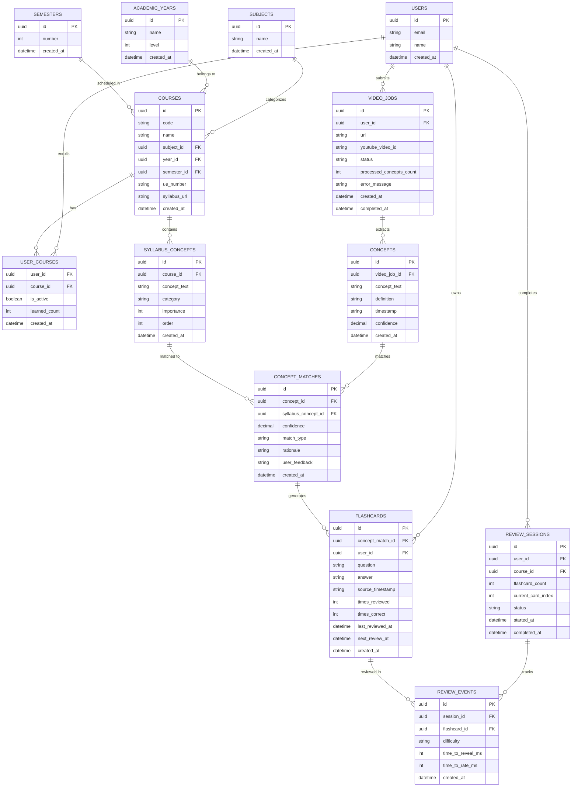

# Entity Relationship Diagram

## Notes

- **Normalized schema**: 13 tables (3 new: subjects, academic_years, semesters)
- **French university structure**: Courses reference subject, year, semester for proper UE organization
- **Dynamic concept counts**: Total concepts per course computed from `COUNT(syllabus_concepts)`, not hardcoded
- **Syllabus-driven**: Concept counts emerge from AI processing of actual syllabus PDFs
- **Hard deletes**: No soft delete columns (`deleted_at`)
- **No retention policies**: Keep all data for demo
- **Single active course**: `user_courses.is_active` flag
- **Pre-computed learned_count**: `user_courses.learned_count` for dashboard performance ("12 learned")
